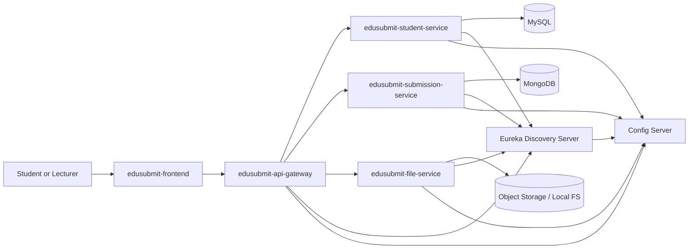

# edusubmit-main

Main polyrepo orchestrator repository for the EduSubmit microservices system.

## Repository Structure

```text
edusubmit-main/
├─ services/
│  ├─ edusubmit-config-server/        (git submodule)
│  ├─ edusubmit-discovery-server/     (git submodule)
│  ├─ edusubmit-api-gateway/          (git submodule)
│  ├─ edusubmit-student-service/      (git submodule)
│  ├─ edusubmit-submission-service/   (git submodule)
│  └─ edusubmit-file-service/         (git submodule)
├─ frontend/
│  └─ edusubmit-frontend/             (git submodule)
├─ docs/
└─ README.md
```

## Add Submodules

Run these commands from `edusubmit-main` root after `git init`:

```bash
git submodule add <REPO_URL_CONFIG_SERVER> services/edusubmit-config-server
git submodule add <REPO_URL_DISCOVERY_SERVER> services/edusubmit-discovery-server
git submodule add <REPO_URL_API_GATEWAY> services/edusubmit-api-gateway
git submodule add <REPO_URL_STUDENT_SERVICE> services/edusubmit-student-service
git submodule add <REPO_URL_SUBMISSION_SERVICE> services/edusubmit-submission-service
git submodule add <REPO_URL_FILE_SERVICE> services/edusubmit-file-service
git submodule add <REPO_URL_FRONTEND> frontend/edusubmit-frontend
```

For teammates cloning the main repo:

```bash
git clone <REPO_URL_MAIN>
cd edusubmit-main
git submodule update --init --recursive
```

## Architecture Diagram (Markdown)



## Startup Order

1. `edusubmit-config-server` (port `8888`)
2. `edusubmit-discovery-server` (port `8761`)
3. `edusubmit-api-gateway` (port `8080`)
4. `edusubmit-student-service` (registers to Eureka)
5. `edusubmit-submission-service` (registers to Eureka)
6. `edusubmit-file-service` (registers to Eureka)
7. `edusubmit-frontend` (connects to API Gateway)

## Local Setup Guide

1. Prerequisites
- Java 25
- Maven 3.9+
- Node.js 20+
- MySQL 8+
- MongoDB 6+
- Git

2. Clone and initialize

```bash
git clone <REPO_URL_MAIN>
cd edusubmit-main
git submodule update --init --recursive
```

3. Start local data stores
- Start MySQL for `student-service`
- Start MongoDB for `submission-service`
- Start storage backend (or local disk) for `file-service`

4. Configure environment files
- Ensure each service has correct DB and service URLs
- Ensure all services point to Config Server (`http://localhost:8888`)
- Ensure frontend base URL points to API Gateway (`http://localhost:8080`)

5. Start backend services in startup order

```bash
cd services/edusubmit-config-server && mvn spring-boot:run
cd services/edusubmit-discovery-server && mvn spring-boot:run
cd services/edusubmit-api-gateway && mvn spring-boot:run
cd services/edusubmit-student-service && mvn spring-boot:run
cd services/edusubmit-submission-service && mvn spring-boot:run
cd services/edusubmit-file-service && mvn spring-boot:run
```

6. Start frontend

```bash
cd frontend/edusubmit-frontend
npm install
npm run dev
```

## Eureka Dashboard URL Placeholder

- Local: `http://localhost:8761/`
- Deployment placeholder: `<EUREKA_DASHBOARD_URL>`

## GCP Deployment Notes

- Containerize each service (`Dockerfile` per repo) and push images to Artifact Registry.
- Deploy services to Cloud Run or GKE.
- Use Secret Manager for DB passwords, JWT secrets, and service keys.
- Use Cloud SQL for MySQL and Atlas/GCP-hosted MongoDB or MongoDB on GCE/GKE.
- Externalize config via Config Server with production profile and secure backing repo.
- Use Cloud Load Balancer for frontend and API Gateway entry points.
- Restrict service-to-service traffic using VPC networking and private service ingress.
- Add Cloud Monitoring dashboards and alert policies for health endpoints.

## Screen Recording Checklist

Use this checklist before final demo submission:

- [ ] Show `edusubmit-main` repo structure and initialized submodules.
- [ ] Show Config Server running and serving config.
- [ ] Show Eureka dashboard with all services registered.
- [ ] Show API Gateway route access working.
- [ ] Show student registration and login flow from frontend.
- [ ] Show course creation and listing.
- [ ] Show assignment creation and listing.
- [ ] Show file upload + submission creation.
- [ ] Show lecturer viewing submissions and grading.
- [ ] Show health endpoints (`/actuator/health`) for key services.
- [ ] Show one failure scenario and recovery (restart service / retry).
- [ ] Conclude with deployment target notes (GCP).
# edusubmit-main
